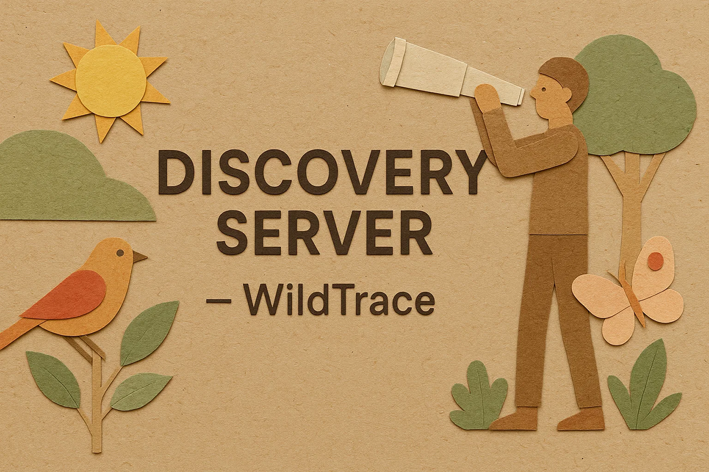

<div style="text-align: center;">
  
</div>

# WildTrace – Discovery Server

Este módulo forma parte de **WildTrace**, una arquitectura de microservicios basada en Spring Cloud para el registro de avistamientos de fauna en zonas naturalizadas.

Este submódulo implementa un **Eureka Server**, encargado de registrar y descubrir automáticamente los microservicios del ecosistema, permitiendo su comunicación dinámica sin necesidad de conocer IPs o puertos estáticos.

---

## 🚀 ¿Qué es un Discovery Server?

Un Discovery Server basado en **Eureka** (Netflix OSS) permite que los servicios cliente (como `species-service`, `zone-service`, `sighting-service` y `gateway-service`) se registren y obtengan información unos de otros para comunicar entre sí.

- Actúa como un **DNS dinámico** para microservicios.
- Optimiza la escalabilidad y la resiliencia del sistema distribuido.

---

## ⚙️ Configuración recomendada (`application.properties`)

```properties
spring.application.name=discovery-server
server.port=8761
eureka.client.register-with-eureka=false
eureka.client.fetch-registry=false
```

> Estos valores hacen que el servidor no intente registrarse a sí mismo.

---

## ▶️ Ejecución local

1. Asegúrate de tener Java 21 instalado.
2. Compila el módulo:

```bash
cd discovery-server
mvn clean install
```

3. Ejecuta el servidor Eureka:

```bash
mvn spring-boot:run
```

4. Accede a la consola Eureka:
```
http://localhost:8761
```

---

## 🧩 Servicios registrados esperados

Al levantar correctamente el ecosistema, deberías ver los siguientes microservicios registrados en el dashboard de Eureka:

- `SPECIES-SERVICE` – Puerto 8081
- `ZONE-SERVICE` – Puerto 8082
- `SIGHTING-SERVICE` – Puerto 8083
- `GATEWAY-SERVICE` – Puerto 8080

---

## ☑️ Tecnologías utilizadas

- Java 21
- Spring Boot 3.4.6
- Spring Cloud Netflix Eureka Server
- Maven

---

## 🧪 Pruebas

No requiere lógica de negocio ni base de datos. Para verificar que está funcionando correctamente:

- Asegúrate de que el dashboard de Eureka muestre servicios en estado `UP`.
- Prueba acceder a través de un cliente (`RestTemplate`, `Feign`) desde otro microservicio.

---

## 🛠️ Enlaces útiles

- [Documentación Eureka](https://cloud.spring.io/spring-cloud-netflix/multi/multi_spring-cloud-eureka-server.html)
- [Spring Cloud Discovery](https://docs.spring.io/spring-cloud-commons/docs/current/reference/html/#spring-cloud-discoveryclient)

---

Desarrollado con ❤️ para **WildTrace**